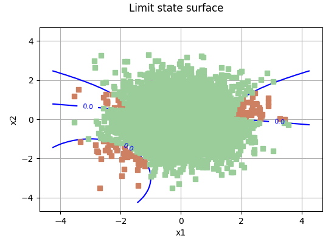
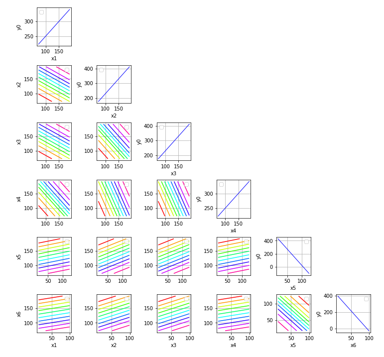
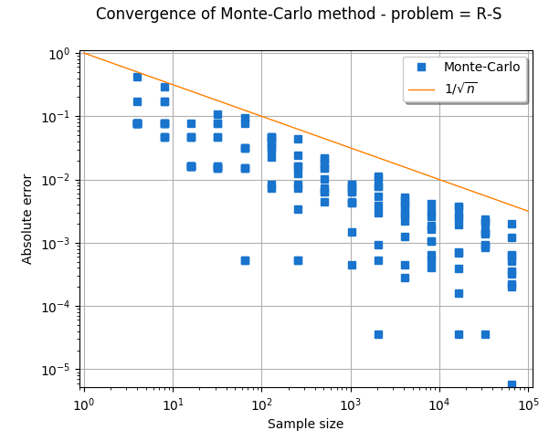

[](https://circleci.com/gh/mbaudin47/otbenchmark)

# otbenchmark

## What is it?

The goal of this project is to provide benchmark classes for OpenTURNS. 
It provides a framework to create use-cases which are associated with
reference values.
Such a benchmark problem may be used in order to check that a given
algorithm works as expected and to measure its performance in terms 
of accuracy and speed.

Two categories of benchmark classes are currently provided:
* reliability problems, i.e. estimating the probability that 
the output of a function is less than a threshold,
* sensitivity problems, i.e. estimating sensitivity indices, 
for example Sobol' indices.

Most of the reliability problems were adapted from the RPRepo :

https://rprepo.readthedocs.io/en/latest/

This module allows you to create a problem, run an algorithm and 
compare the computed probability with a reference probability: 

```
problem = otb.RminusSReliability()
event = problem.getEvent()
pfReference = problem.getProbability() # exact probability
# Create the Monte-Carlo algorithm
algoProb = ot.ProbabilitySimulationAlgorithm(event)
algoProb.setMaximumOuterSampling(1000)
algoProb.setMaximumCoefficientOfVariation(0.01)
algoProb.run()
resultAlgo = algoProb.getResult()
pf = resultAlgo.getProbabilityEstimate()
absoluteError = abs(pf - pfReference)
```

Moreover, we can loop over all problems and run several methods on these 
problems.

## Authors

* Michaël Baudin
* Youssef Jebroun
* Elias Fekhari
* Vincent Chabridon

## Installation

To install the module, we can use the "git clone" command:

```
git clone https://github.com/mbaudin47/otbenchmark.git
cd otbenchmark
python setup.py install
```

## Getting help

The code has docstrings. Hence, using the "help" statement will help. Another way of getting help is to read the examples, which are presented in the next section.

## Overview of the benchmark problems

[Analysis of the R-S case]: https://github.com/mbaudin47/otbenchmark/blob/master/examples/reliability_problems/Cas-R-S.ipynb

[Benchmark the G-Sobol test function]: https://github.com/mbaudin47/otbenchmark/blob/master/examples/sensitivity_problems/GSobolSensitivity.ipynb

[Reliability factories]: https://github.com/mbaudin47/otbenchmark/blob/master/examples/methodFactory.ipynb

[Benchmark on a given set of problems]: https://github.com/mbaudin47/otbenchmark/blob/master/examples/reliability_benchmark.ipynb

[Benchmark the reliability solvers on the problems]: https://github.com/mbaudin47/otbenchmark/blob/master/examples/reliability_benchmark_table.ipynb

[Check reference probabilities with Monte-Carlo]: https://github.com/mbaudin47/otbenchmark/blob/master/examples/reliability_compute_reference_proba.ipynb

The simplest use cas of the library is in [Analysis of the R-S case], which shows how to use this problem with two variables to estimate its failure probability. In the [Benchmark the G-Sobol test function] problem, we show how to estimate sensitivity indices on the G-Sobol' test function. When using a reliability problem, it is convenient to create a given algorithm, e.g. Subset sampling, based on a given problem: the [Reliability factories] shows how to do this for Monte-Carlo, FORM, SORM, Subset and FORM-importance sampling. 

The library currently has:
* 26 reliability problems,
* 4 sensitivity problems.

One of the most useful feature of the library is to perform a benchmark that is, loop over the problems. In [Benchmark on a given set of problems], we run several algorithms on all the problems. The associated statistics are gathered in table, presented in [Benchmark the reliability solvers on the problems]. In [Check reference probabilities with Monte-Carlo], we compare the exact (reference) probability with a Monte-Carlo estimate with a large sample.

[Draw events]: https://github.com/mbaudin47/otbenchmark/blob/master/examples/DrawEvent_demo.ipynb
[Draw cross cut of functions]: https://github.com/mbaudin47/otbenchmark/blob/master/examples/CrossCutFunction_Demo.ipynb
[Draw cross cuts of distributions]: https://github.com/mbaudin47/otbenchmark/blob/master/examples/CrossCutDistribution-3D_Demo.ipynb
[Draw conditional distributions]: https://github.com/mbaudin47/otbenchmark/blob/master/examples/ConditionalDistribution_Demo.ipynb

It is often useful to draw a sensitivity or reliability problem. Since many of these problems have dimensions larger than two, this raises a number of practical issues.
* Event: [Draw events] shows how to draw an multidimensional event,
* Function: [Draw cross cut of functions] shows how to draw cross cuts of functions,
* Distribution: [Draw cross cuts of distributions] shows how to draw cross cuts of distributions and [Draw conditional distributions] plots conditional distributions.

The "DrawEvent" class that the module provides typically plots the following figure for the RP57.



The following figure plots cross-cuts of the limit state function for the RP8.



[Examples]: https://github.com/mbaudin47/otbenchmark/tree/master/examples

[BBRC]: https://github.com/mbaudin47/otbenchmark/blob/master/examples-on-server/BBRC.ipynb

[Convergence of Monte-Carlo to estimate the probability in a reliability problem]: https://github.com/mbaudin47/otbenchmark/blob/master/examples/convergence-reliability-Monte-Carlo.ipynb

The [Convergence of Monte-Carlo to estimate the probability in a reliability problem] example might be interesting for those who want to plot convergence graphics.



We provide in [BBRC] an example which shows how to use the "evaluate" function that the module provides to evaluate a function which is available in the remote BBRC server. 

The [Examples] directory has many other examples: please read the notebooks and see if one of the examples fits your needs.

## TODO-List

* The FORM algorithm does not perform correctly on: RP75, RP111
and Four-branch serial system.
An explanation would be required for this.

* The computeCDF() method does not perform correctly on many problems.
An explanation would be required for this.

